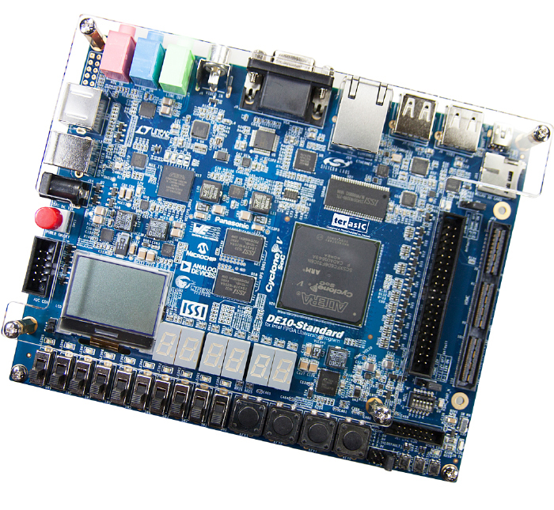
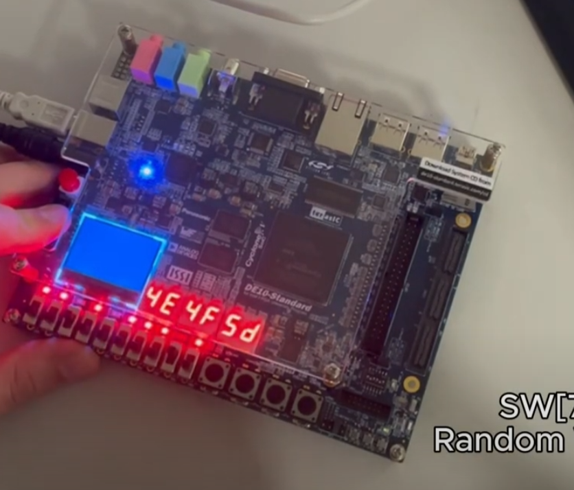

# DE10-Standard Switch Control Program

This project is designed for the DE10-Standard board and demonstrates how to control HEX displays, LEDs, and switches using a memory-mapped I/O system.

## Overview

The program interacts with three key hardware components:
    
- HEX Display: Displays various values based on user input.

- LEDs (LEDR): Lights up based on the current value or special operations.

- Switches: User controls that trigger different operations on the current value.
    
### Features

- Increment, decrement, multiply, and divide operations controlled by switches.

- Random number generation.

- Digit reversal.

- Value encryption using an XOR cipher.

- Real-time output to the HEX display and LEDs.

- Switch-based blinking LED functionality.

### Switch Operations

Each switch has a unique function, outlined below:

Switch (Hex) -> Function

`0x01` Increment the current value

`0x08` Decrement the current value

`0x10` Multiply the current value by 2

`0x20` Divide the current value by 2

`0x80` Generate a pseudo-random number

`0x100` & `0x200` Reverse the digits of the current value

`0x40` Toggle blinking mode

`0x04` Encrypt the current value with XOR cipher

`0x02` Display the current value in formatted HEX

### Functions

`xor_cipher(unsigned int input, unsigned int key)`

Encrypts the input value using a simple XOR cipher with the provided key.

`generate_random()`

Generates a pseudo-random number using a deterministic formula.

`reverse_digits(unsigned int n)`

Reverses the digits of the input number.

## Reverses the digits of the input number.

1. Initialization:
- The program initializes memory-mapped registers for the HEX display, LEDs, and switches.

- A `current_value` variable is used to store and modify the value displayed.

2. Switch Handling:

- The program continuously reads switch values.

- It checks for state changes (i.e., when a switch is turned on or off) and performs operations accordingly.

3. Output Updates:

- The program updates the LED and HEX display values based on the selected operation.

- It uses `usleep()` delays to provide smooth transitions and prevent bounce effects.

## Potential Improvements

- Implement switch debouncing to improve reliability.

- Optimize HEX display formatting for better readability.

- Extract repetitive code into functions for better maintainability.

